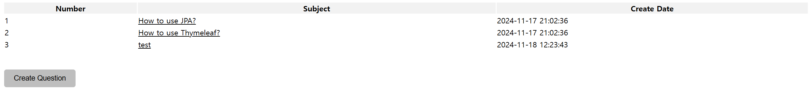
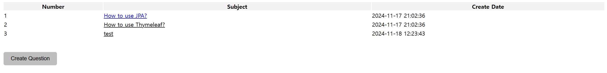
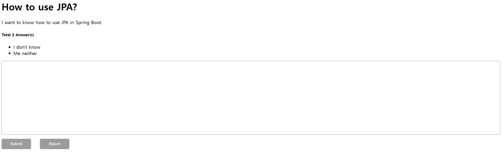
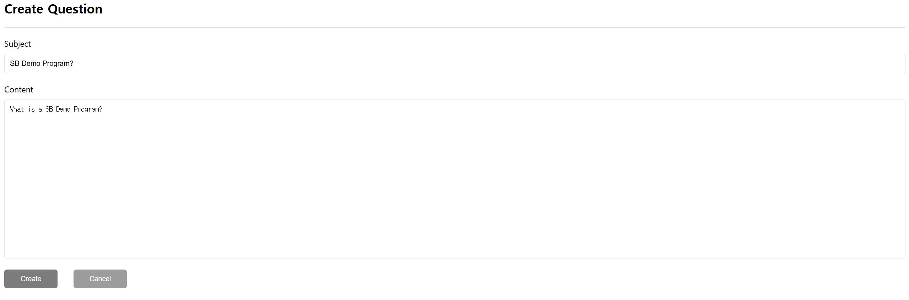
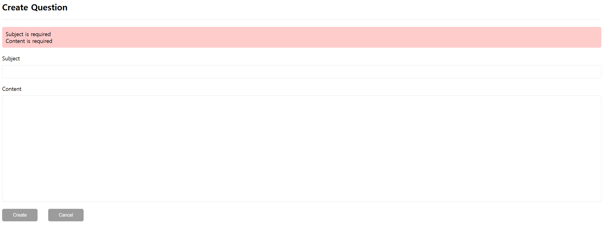
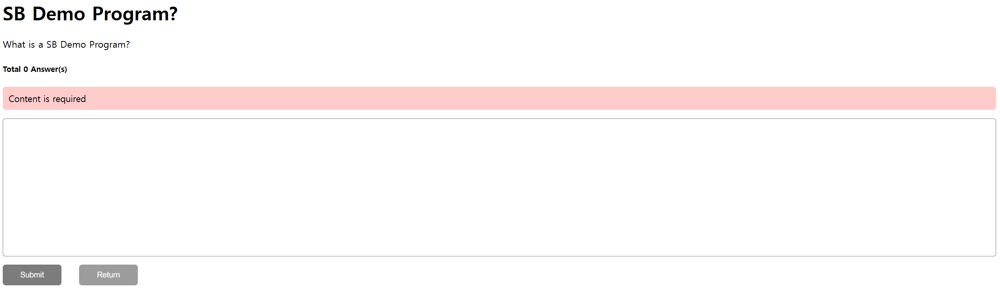

# SBDemoProgram

A simple REST Api service with Spring Boot.

## Technology Stacks

-   IDE: VSCode
-   Packet manager: Gradle
-   Frontend: Java, Thymeleaf, Html, Css
-   Backend: Spring Boot
-   Databank: H2, JPA
-   Test: Junit
-   Library: Lombok, Validation

## Usage

```bash
.\gradlew.bat runBoot
```

You can explore this program at http://localhost:8080/question/list. http://localhost:8080 will be redirected to http://localhost:8080/question/list automatically.

## Example

You will find this following question list at http://localhost:8080/question/list.



The question's subject, content and answers will be shown when you click on a question of the list.





You can also post a question.



If any input value is empty, the Spring Validation will detect it and throw error.



